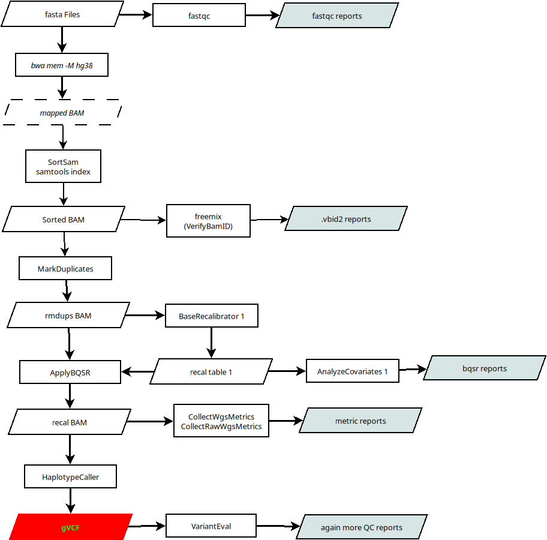

# WESpipe

Parallel processing for whole exome sequencing (WES) or whole genome sequencing (WGS) pipeline. [Why in Perl?](https://xkcd.com/224/)



## Before you go

These scripts use SLURMACE library. To install it just run the *install\_slurmace.sh* script provided here. This should install the perl module into your local PERL5 directory.

```bash
curl -sL https://raw.githubusercontent.com/asqwerty666/wespipe/refs/heads/main/install_slurmace.sh | bash
```

**Also, in order to the scripts work properly, you should edit the module *wxsInit.pm* guaranteeing that you local reference data and executable paths are found.**

## scripts

The whole project is just a bunch of scripts that use GATK and other tools to run WXS pipeline. 

   * fasta2cram.pl : Transform FASTA files to aligned HG38 CRAM files
   * fasta2vcf.pl : Launch WXS pipeline from FASTA to gVCF files
   * realign.pl : Realign BAM files from B37 to HG38
   * bam2vcf.pl : Launch WXS pipeline from BAM (or CRAM) to gVCF files
   * vcfjoint.pl : Make a joint call from gVCF files
   * parse\_wes\_reports.pl : Parse the WES QC files and make a report
   * parse\_wgs\_reports.pl : Parse the WGS QC files and make a report
   * wtf\_tranches.pl : Help to inspect joint call tranches (beta prototype)

## GET your references

First of all you will need to download your references from GATK bucket or something similar. I just downladed everything I need from  https://storage.googleapis.com/genomics-public-data/resources/broad/hg38/v0/. 

Now you need to know your data. FASTA or CRAM files should be together with some libraries (what GATK call _bait_ and _target_). You should bulid the _interval-list_ files (see https://gatk.broadinstitute.org/hc/en-us/articles/360036726611-BedToIntervalList-Picard).

and remember to index all the ref vcf files,

```bash
while read -r vcf; do gatk IndexFeatureFile -I ${vcf}; done < toindex.txt
```

So far all should be ready to run the WXS pipeline.

## Just go

Now you are ready to go but first you will need to create/edit an init file, that is, a file describing your data. This is an example for building the *gVCF* files,


```
# Source dir of FASTA or CRAM files 
src_dir = /home/Genomics/Data/Raw.data/Myproject/FASTA/ 
# Directory containing BAIT and TARGET interval lists 
panel_dir = /home/Genomics/Data/Reference/Myproject/
# BAIT + TARGET intervals.  
unions = Exome_RefSeq_unions.interval_list 
# BAIT + TARGET bed file. Usually the original where the interval lists come from (not sure if needed) 
union_bed = Exome_RefSeq_hg38.bed 
# Output directory. Where your results will be stored 
outdir = /home/osotolongo/wes/output 
# Search pattern for FASTA or CRAM files. Actually the part that is different from first and second fasta 
search_pattern = _1.fastq.gz 
# Pattern for the second FASTA 
alt_pattern = _2.fastq.gz 
# Pattern for excluding files. Do not process files with this string in the path 
cleaner = call 
# Identifier for the platform of adquisition 
platform = ILLUMINA 
# Identifier for the adquisition libraries 
libraries = NGS
```

You should respect the name of variables inside this file since the scripts depend on them. Then you find the script that suits your needs and try it! Notice that every script will need an independent _init_ file since the output directory of one could be the source directory of the next. So, in the former example, the *init* file for running the *vcfjoint.pl* script, after *gVCF* files are obtained is something like,


```
src_dir = /home/osotolongo/wes/output 
outdir = /home/osotolongo/wes/joint 
search_pattern = _raw.snps.indels.g.vcf.gz
```

while for the reports generation is enough with something like,

``` 
src_dir = /home/osotolongo/wes/output 
outdir = /home/osotolongo/wes/report 
```

**This info needs to be edited carefully for any step.** 

However, it is OK if you leave unused variables as is, since the script will ignore them. For instance, if you run a WGS analysis, the *panel\_dir* variable do not apply for the script but is OK if you leave it there, since it is silently ignored by the script.

### Some options

The scripts has also some basic input options to do some testing in your sample,

```bash
~/wespipe/myscript.pl -i project.init [-c subjects.list] [-m wgs] [-g] [-t]
```

   * -i : the only compulsory option *-i project.init*, pointing where your init file is.
   * -c : especify a file with a subset of the subjects to analyze, run the script only on these subjects
   * -m : optionally especify if the data is WGS (*-m wgs*) or WES (*default*) 
   * -g : for debugging pourposes, do not remove intermediate temporary files
   * -t : actually do not run nothing but create the full SLURM structure, useful to inspect slurm scripts that will be send into the cluster

## TO DO
   
   * More test on real data
   * More docs!


